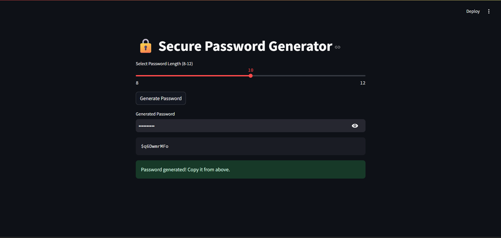

# 🔒 Secure Password Generator (Streamlit App)

A web-based password generator built using **Streamlit**.  
Generates strong passwords using:
- ✅ Uppercase Letters (A-Z)
- ✅ Lowercase Letters (a-z)
- ✅ Numbers (0-9)
- ✅ Special Characters (`@`, `#`, `$`)

Includes **Copy to Clipboard** feature 🔥

---

## 🚀 Demo


---

## ✅ Features

- Generate passwords of **length 8 to 12**.
- Uses a mix of:
  - Capital letters
  - Small letters
  - Numbers
  - Special characters: `@`, `#`, `$`
- Password **Copy to Clipboard** button.
- Built with **pure Streamlit + JavaScript** (No extra dependencies).

---

## 📦 Requirements

- Python 3.7+
- Streamlit

---

## 🛠️ Installation

1. **Clone the repo:**
   ```bash
   git clone https://github.com/yourusername/password-generator-app.git
   cd password-generator-app


Install dependencies:
pip install -r requirements.txt


▶️ Run the App

streamlit run app.py
App will open in your browser at:
http://localhost:8501

🏗️ Built With
Streamlit - Python framework for web apps
HTML + JavaScript (for clipboard copy feature)